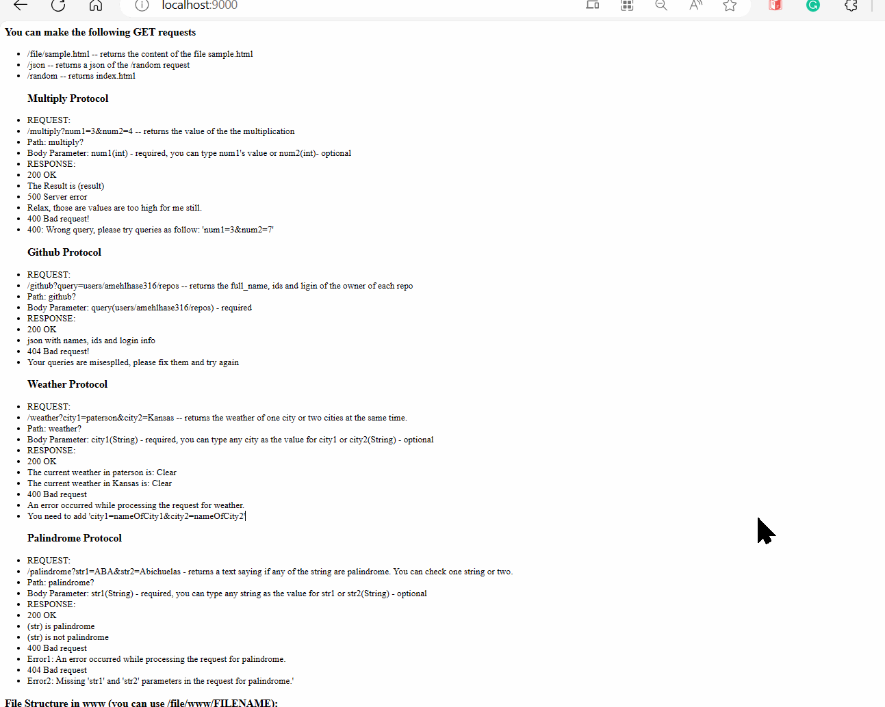

#### Purpose:

Simple Java Web Server
This project is a basic web server implemented in Java that allows users to make simple HTTP GET requests. The server listens on localhost:9000 and provides the following endpoints:

Random Image: Accessing localhost:9000/random shows a randomly selected image from a predefined set.

JSON Response for Random Image: Accessing localhost:9000/json provides the JSON response for the randomly selected image.

Raw File: Accessing localhost:9000/file/filename shows the raw content of the specified file (not as HTML).

Multiply Numbers: Accessing localhost:9000/multiply?num1=3&num2=4 multiplies the provided numbers and responds with the result.

GitHub Repositories: Accessing localhost:9000/github?query=users/amehlhase316/repos (or other GitHub repo owners) retrieves JSON information about GitHub repositories. Note: The response is currently printed in the console.

Weather Information: Accessing localhost:9000/weather?city1=nameOfCity1&city2=nameOfCity2 retrieves weather information for the specified cities from OpenWeatherMap API.

Palindrome Check: Accessing localhost:9000/palindrome?str1=text1&str2=text2 performs a palindrome check on the provided strings.

Usage
Compile and run the WebServer class.
Access the endpoints using a web browser or a tool like cURL.
Endpoints Details
The server reads HTTP requests manually.
The /random and /json endpoints serve random images.
The /file/filename endpoint displays raw file content.
The /multiply?num1=3&num2=4 endpoint multiplies two provided numbers.
The /github?query=users/amehlhase316/repos endpoint retrieves GitHub repository information (console output).
The /weather?city1=nameOfCity1&city2=nameOfCity2 endpoint fetches weather information.
The /palindrome?str1=text1&str2=text2 endpoint checks if provided strings are palindromes.

Run through

gradle FunWebServer
